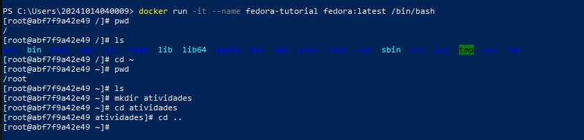
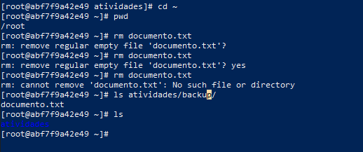
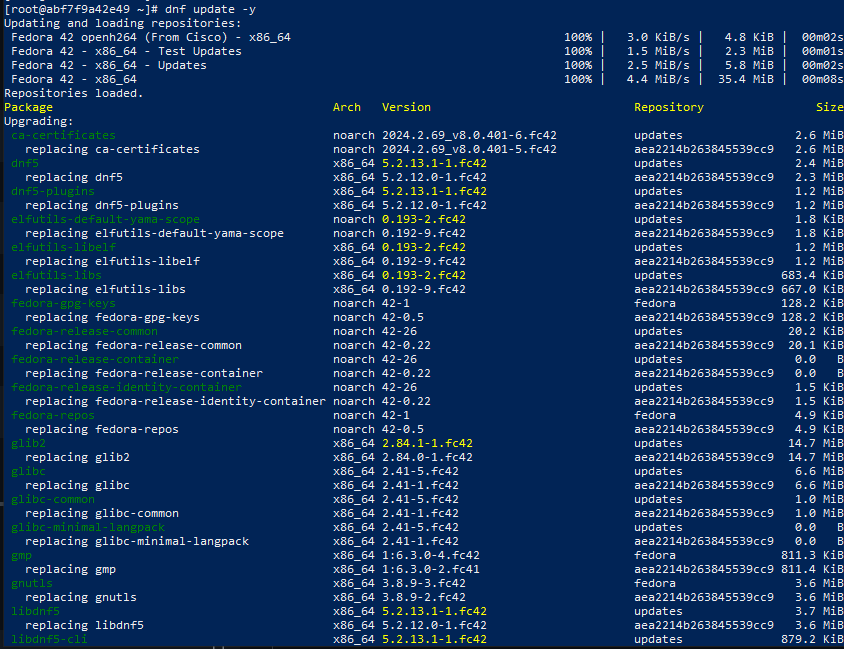
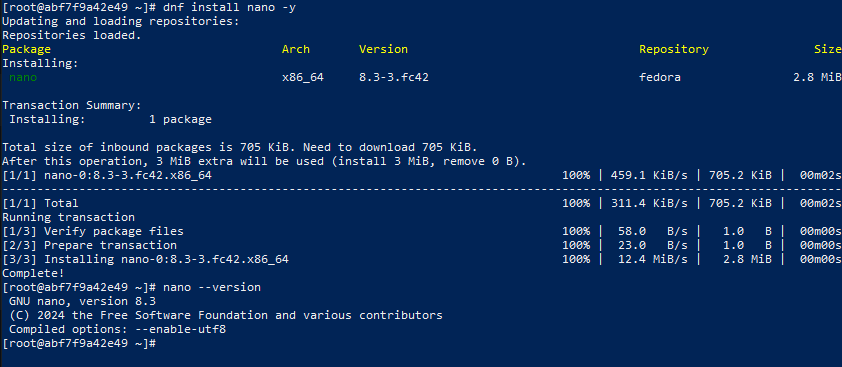
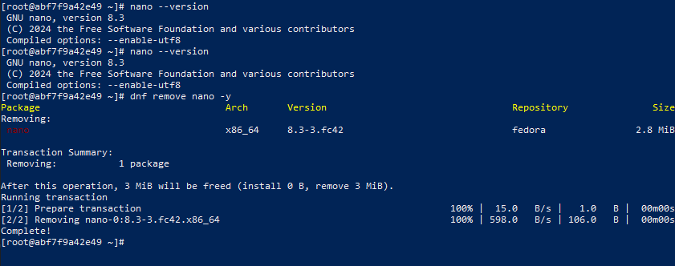
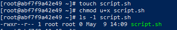
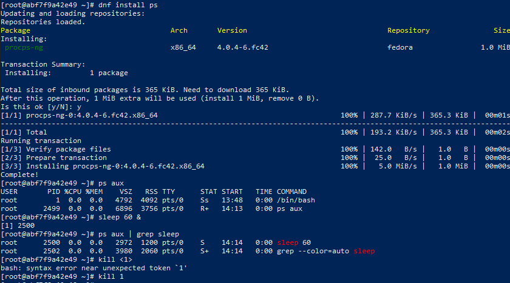
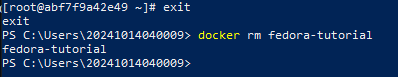

# S.O. 2025.1 - Atividade 02 - Introdução a linux usando docker no windows
## Aluna: Emanuelly Karine Fernandes dos Santos
## Data: 09/05/2025

# Objetivo do exercício

Realizar exercícios práticos com comandos básicos do Linux em um contêiner Docker baseado no Fedora, utilizando comando para manipulação de arquivos, gereciamento de pacotes e visualização de processos em execução.

# Relato sobre o exercício
## 1. Navegação básica

- A prática foi iniciada com a utilização de comando para a nevegação básica, utilizando o Docker e o PowerShell foi iniciado a imagem do fedora para dar início aos comandos.
- Logo após foi utilizado o comando **"pwd"** para ver o diretório em que estava, sendo **"/"** indicando que estava na raiz. O comando **"ls"** é utilizado para visualizar as pastas e arquivos contidos naquele diretório em que estamos.
- Quando é utilizado o comando **"cd ~"** somos levados para o diretório home ou seja root que é o nome do usuário. E assim foi utilizado também o comando **"ls"** para ver quais arquivos estão contidos ali, não havendo nenhum.
- Após isso é utilizado o comando **"mkdir"** para criar a pasta atividades dentro do diretório home, com o comando **"cd atividades"** entramos nesse diretório e o **"cd .."** é utilizado para sair desse diretório.
**Abaixo está a captura de tela de todos os comandos utilizados nessa etapa.**

## 2. Manipulação de arquivos
- Nessa etapa iniciamos acessando o diretório home do usuário com o comando **"cd ~"** e verificando se estamos nesse diretório com o comando **"pwd**. 
- Após isso criamos um arquivo chamado "arquivo1.txt" utilizando o comando **"touch"** e renomeamos ele para "documento.txt" com o comando **"mv"**, acessamos a pasta atividades, já que estavámos na pasta home, e dentro dela criamos um subdiretório chamado "backup" utilizando o **"mkdir"** e copiamos o arquivo "documento.txt" para esse diretório utilizando o comando **"cp ~/documento.txt backup/**.
- A imagem abaixo ilutra os passos finais dessa etapa onde voltamos ao diretório home usando o comando **"cd ~"** e confirmando se estamos nele utilizando o comando **"pwd"**. Por fim excluímos o arquivo "documento.txt" na home, já que havíamos copiada ele pra backup, com o comando **"rm"** e confirmando com o yes, e por fim verificamos se o arquivo ainda existe no diretório backup com o comando **"ls"**.

## 3. Gerenciamento de pacotes
### 3.1 Atualizando lista de pacotes
- Nessa etapa utilizamos o comando **"dnf updte -y"** para atualizar o pacote dnf e o "-y" serve para confirmar de forma direta e concordar com a atualização.

### 3.2 Instalando editor de texto nano
- Agora instalamos o editor de texto nano utilizando novamente o comando **"dnf"** porém passando como paramêtros **"install nano -y"**. Após instalar usamos **"nano --version"** para ver se a instalação funcionou.

### 3.4 Desinstalando o nano
- Utilizamos o comando **"dnf remove nano -y"** para remover o editor de texto nano.

## 4. Permissão de arquivos
- Para modificar a permissão de arquivos precisamos inicialmente criar um novo arquivo com o comando **"touch"** com o nome de "script.sh".
- Após a criação utilizamos o comando **"chmod"** passando como paramêtro o "u" para dar permissão ao dono e o "x" para ser uma permissão de execução e o nome do arquivo ao qual estamos dando permissão.
- No fim verificamos se a permissão está funcionando com o comando **"ls -l"** com o nome do arquivo.
- OBS: Não consegui registrar antes das permissões.
 

## 5. Processos em execução
- Para utilizar o comando principal dessa etapa precisamos instalar o pacote dele utilizando o comando **"dnf install ps"**.
- Após a instalação concluída usamos **"ps aux"** para listar os processos em execução.
- Assim, executamos um processo em segundo utilizando o comando **"sleep 60 &"** e encontramos o PID(Process ID) do processo que estamos executando usando **"ps aux | grep sleep"**, ou seja, liste os processos em execução que possuam sleep. 
- E por fim encerramos esse processo com o comando **"kill 2500"**.

## 6. Encerrando o container
- Para finalizar o exercício utilizamos o comando **"exit"** para sair do container.
- E remover o container após sair **"docker rm fedora-tutorial"**.

# Conclusão
Com a finalização desse exercício pude perceber a quantidade de comando e de coisas que podem ser executada e feitas pelo terminal, foi muito interessante ver também como o docker pode ser utilizado pelo terminal do pc hospedeiro.Além de ser muito legal poder utilizar outro sistema operacional sem precisar trocar o que já temos. 

Minha única dificuldade foi na etapa 5 pois quando tentei executar o ps não funcionou e apenas precisaa instalar esse pacote específico.
